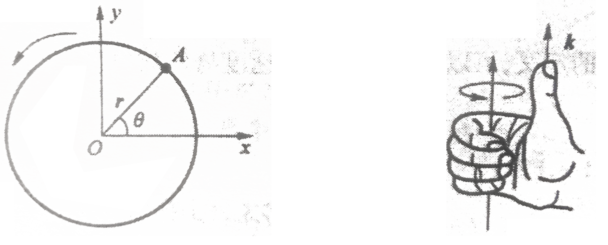
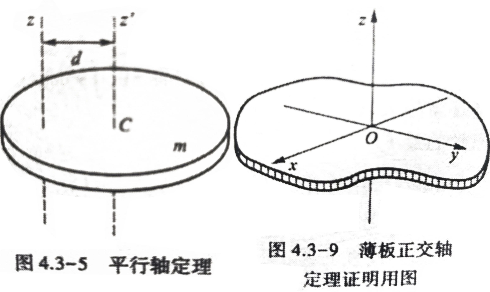

# 大学物理（第2版）上册

## 力学

### 基本概念
- 参考系：用于确定空间`位置和方向`，如直角坐标系、自然坐标系等。
- 位矢$\vec{r}$：相对原点的`位置及方向`
- 位移：*以原点为参考*的矢量，反映位矢的变化量及方向，$\Delta\vec{r}=\vec{r}_B-\vec{r}_A$
- 速度：$\vec{v}=\frac{\Delta \vec{r}}{\Delta t}=\frac{\mathrm{d}\vec{r}}{\mathrm{d}t}=\frac{\mathrm{d}x}{\mathrm{d}t}\vec{i}+\frac{\mathrm{d}y}{\mathrm{d}t}\vec{j}+\frac{\mathrm{d}z}{\mathrm{d}t}\vec{k}$
- 加速度：$\vec{a}=\frac{\Delta \vec{v}}{\Delta t}=\frac{\mathrm{d}\vec{v}}{\mathrm{d}t}=\frac{\mathrm{d}^2r}{\mathrm{d}t^2}$
  
### 运动的分解与合成

叠加原理：若物体同时参与两个或两个以上的运动时，包括沿不同方向、转动等，其总的运动可以看作是由各个相互独立的分运动叠加而成的。最常用的是按坐标轴的正交分解合成，当然也可以如上图所示的依据特征的分解合成，关键是找出相互独立的成分。

描述圆周运动时，采用自然坐标系比较方便，就是: 
- 原点始终在物体（质心）,随物体移动，
- 以物体运动切线方向$\vec{e}_t$和
- 与切线垂直并指向圆心的法线方向$\vec{e}_n$为坐标轴

这种情况下速度只有切向分量，为：$\vec{v}=v\vec{e}_t$
加速度既有切向分量，也有法向分量，法向分量不改变速率大小，只改变速度方向：$\vec{a}=\frac{\mathrm{d}\vec{v}}{\mathrm{d}t}=\frac{\mathrm{d}(v\vec{e}_t)}{\mathrm{d}t}=\frac{\mathrm{d}v}{\mathrm{d}t}\vec{e}_t+\frac{v^2}{r}\vec{e}_n$，其中$r$为圆半径，或称曲率半径。

>注意单位矢量$\vec{e}_t$和$\vec{e}_n$相互垂直，在拐弯(圆周)运动中还有如下关系：$\mathrm{d}\vec{e}_t=\mathrm{d}\varphi\cdot\vec{e}_n$，其中$\mathrm{d}\varphi$为$\mathrm{d}t$内$\vec{e}_t$随$\vec{v}$变化转过的弧度。就是说$\mathrm{d}t$时间内速度方向的改变$\mathrm{d}\vec{e}_t$的大小为$\mathrm{d}\varphi$，方向为$\vec{e}_n$，

>从上述说明可以看出，其实$\vec{e}_t$和$\vec{e}_n$由于方向实时在改变，本身其实是定义在一个假想的固定坐标系中，这样就能根据其在固定坐标系的数字表达进行求微分等运算，然后再将运动与这两个符号化的单位向量相连，此时运动的参数和方向就以这两个向量为基础进行表达，可以简化运动中诸如动量、动能等物理参数的等计算。

圆周运动一般用角量描述：
- 转过的角度：$\theta=\theta(t)$
- 角速度：$\omega=\frac{\mathrm{d}\theta}{\mathrm{d}t}\vec{k}$。
  >角速度的方向以它的转轴来描述（符合右手螺旋法则），这种矢量定义非常方便角速度的合成，合成后矢量方向就确定了旋转平面，要习惯这种描述，并尝试多去应用。
- 角加速度：$\alpha=\frac{\mathrm{d}\omega}{\mathrm{d}t}$

可见，圆周运动中速率与角速度的关系为$v=r\omega$,加速度$\vec{a}$与$\alpha$和$\omega$的关系为：$a_t=r\alpha, a_n=r\omega^2$，这些数量关系还是需要稍微理解熟悉一下的。

### 牛顿定理、动量、动能、转动

- 定义
  - 动量：$p=m\vec{v}$，质量与速度乘积
  - 冲量：$\vec{F}\mathrm{d}t$代表力的时间累积效应
  - 动能：$E_k=\frac{1}{2}mv^2$、$E_k=\frac{1}{2}J\omega^2$。质点系的动能由质心的动能和相对质心运动质点动能两部分组成（柯西尼定律）。
  - 做功：$A=\vec{F}\cdot \mathrm{d}\vec{s}=F\mathrm{cos}\theta\mathrm{d}s$，结果是标量，$\theta$是$\vec{F}$和$\mathrm{d}\vec{s}$夹角。做功反映了力的空间累积效应。做功时，力$\vec{F}$和经过的距离$\mathrm{d}\vec{s}$的夹角$\theta$为0，即两者重合（或平行）时，效果最好（$\mathrm{cos}\theta =1$），若两者垂直，则做功为0($\mathrm{cos}\theta =0$).
  - 功率：$P=\frac{\mathrm{d}A}{\mathrm{d}t}=\vec{F}\cdot\vec{v}$。
  - 力矩：$\vec{M}=\vec{d}\times \vec{F}=Fd\mathrm{sin}\theta$是矢量，$\vec{d}$由转轴指向力，$\theta$是$\vec{F}$和$\vec{d}$夹角。力矩方向与它导致物体旋转方向的定义一致，从加入右手手腕根部为转轴，四指为力臂$\vec{d}$，四指弯曲方向为力$\vec{F}$的方向，则竖起的拇指方向为力矩方向。当力臂$\vec{d}$与力$\vec{F}$相互垂直时，力矩最大。若力$\vec{F}$的指向转轴，则因为$\vec{d}$与力$\vec{F}$夹角$\theta$为0，$\mathrm{sin}\theta=0$，力矩为0。
  - 转动惯量：$J=mr^2=\sum m_i r_i^2=\int r^2\mathrm{d}m$，$r$是到转动轴的距离。转动惯量是转动系统（如刚体）自身的特性，只取決于自身质量分布以及距离转轴的距离（的平方）。之所以取距离的平方是为了计算角动量（以及转动动能）时只需再计入角速度，无需再回头考虑力臂等因素。或者说转动惯量就是角动量中剔除角速度因素后余下的物理量。
  - 角动量：$\vec{L}=J\vec{\omega}$、$\vec{L}=\vec{r}\times m\vec{v}$。角动量相比动量里面多一个力臂的因素，即其量纲中多了一个长度项。
  - 势能：保守力场存在势能，保守力（如重力、弹力等）做功与路径无关，只与开始、终止位置有关。
    - 重力势能：$E_g=mgh$
    - 弹性势能：$E=\frac{1}{2}k\, {\varDelta d}^2$

- 关系
  - 牛顿（第三）定律$a=\frac{F}{m}$，力会导致物体加速度的改变
  - 转动定律$\alpha=\frac{M}{J}$，力矩会导致物体角加速度的改变，转动定律是牛顿定律在转动时的体现，对应平动中的牛顿（第三）定律。
  - 动量定律$F\mathrm{d}t=m\mathrm{d}v$，若系统所受合外力为0，则系统动量守恒，内力不改变动量（只会导致能量变化，如爆炸的化学能变为动能，但动量不变，或者一对摩擦力导致动能减小，变为热能，但动量不变）。动量定理和牛顿第三定理从数学公式上可以相互转换，是一个事情的两个方面。可以根据具体情况应用。
  - 角动量定律$M\mathrm{d}t=\mathrm{d}L=J\mathrm{d}\omega$，若力矩为0，则角动量守恒。角动量定律是动量定律分别是平动和转动的对应物，可以联合起来记忆：冲量导致动量的改变（*注意：角动量定律方程两边相比动量定律多长度项*）。
  - 动能定律$A=F\Delta s=\frac{1}{2}mv_1^2-\frac{1}{2}mv_0^2$，力做功会改变物体的动能，导致动能变化。
  - 角动能定律$A=M \Delta \theta=\frac{1}{2}J\omega_1^2-\frac{1}{2}J\omega_0^2$。力矩做功导致的动能变化。转动、平动都有动能，都是一样的能量，量纲也一致（量纲可以简单理解为这个物理量的单位都由那些基本单位组成，比如长度单位为m，而密度单位为$\mathrm{kg/m^3}$）。
  - 若无外力和非保守力做功，则机械能（动能加势能$E=E_k+E_p$）守恒。势能和动能可以相互转化，能量不会凭空消失。

- 刚体转动惯量计算方法和技巧
  - $J=\int r^2 \mathrm{d}m=\begin{cases}
     \int\limits_L r^2 \lambda\mathrm{d}l \\
     \int\limits_S r^2 \sigma\mathrm{d}s \\
     \int\limits_V r^2 \rho\mathrm{d}v
  \end{cases}$

    
  - 平行轴定理$J_z=J_c+md^2$，其中$m$为刚体质量，$d$为质心到转轴$z$的距离。
  - 薄板正交轴定理$J_z=J_x+J_y$
  > 不用专门记忆不同基本形状物体的转动惯量，而是要从刚体转动惯量的定义和计算公式去快速推导，在理解各物理量的基础上，有效结合对称性去分析计算转动惯量。这是渔与鱼的关系。要掌握渔而非强记鱼（当然用渔的过程中记住了也挺好，但硬记容易出错）。在掌握基本形状物体转动惯量的基础上，利用**平行轴定理**和**薄板正交轴定理**，再结合对称性分析（加倍、减半）可以快速得到复杂形状物体的转动惯量。